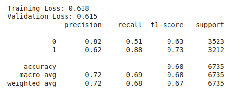
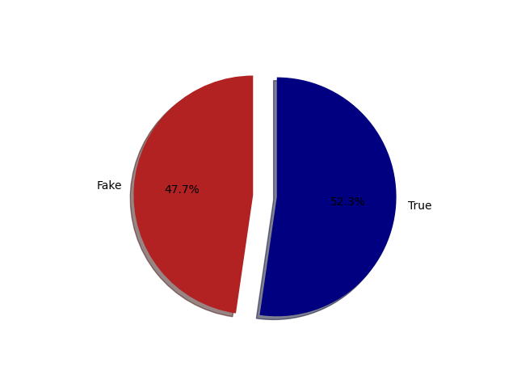
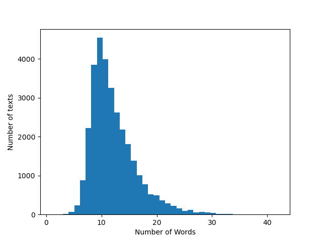

## Fake News Detector  

Binary classifier trained on news headlines. Modified to use polars and mixed precision from [Skillcate AI](https://medium.com/@skillcate/detecting-fake-news-with-a-bert-model-9c666e3cdd9b)

[Dataset](https://www.kaggle.com/datasets/jainpooja/fake-news-detection)

  
  
